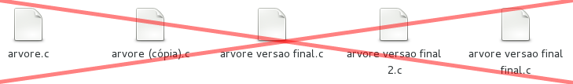
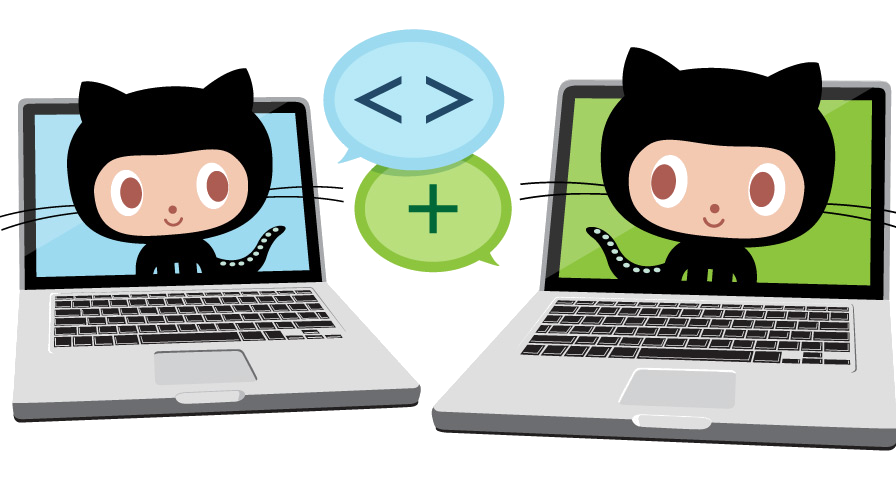
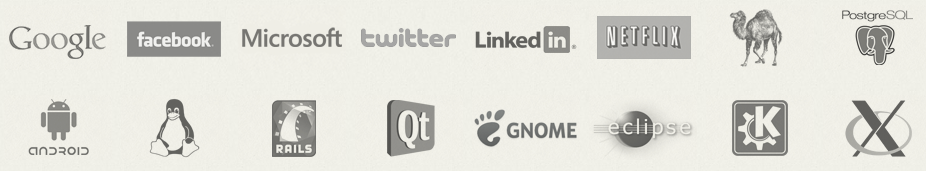

## Front-End | Git e GitHub

<details>
  <summary>1. Git - História</summary>
  
  - Linus Torvalds estava insatisfeito com o BitKeeper, ferramenta de controle de versão que ele utilizava para desenvolver o [kernel do Linux](https://pt.wikipedia.org/wiki/Linux_(n%C3%BAcleo)).

  - O BitKeeper foi substituído pelo Git, que é um sistema de controle de versão de código aberto.

  - O Git é um sistema de controle de versão de código aberto, que permite aos usuários acompanhar o histórico de alterações de um repositório.

  - [Linus Torvalds](https://pt.wikipedia.org/wiki/Linus_Torvalds), que é um dos fundadores do Git, criou o Git em seu laboratório de informática, em Linus Torvalds' home.


  
</details>

<details>
  <summary>2. Git - Mas por que eu usaria um controle de versão? </summary>
  
  ### Organizar o desenvolvimento de software
  - Gerenciar manualmente as versões do seu software não será mais necessário, o Git gerencia de uma forma mais organizada e eficiente para você. 
  

  - O Git oferece controle total do projeto ao desenvolvedor para, entre outras coisas:
    - Visualizar as mudanças ocorridas em cada arquivo;
    - Visualizar o estado do projeto em etapas anteriores;
    - Desfazer mudanças;
    - Desenvolver funcionalidades em paralelo.

  ### Compartilhar projetos
  - Desenvolver projetos colaborativos nem sempre é fácil. Utilizar DropBox, pen drives ou afins para compartilhar código muitas vezes resulta em dor de cabeça.
  

  - Estas ferramentas foram projetadas para fins genéricos, não oferecendo aspectos importantes para uma equipe de desenvolvimento, como histórico de ações de cada colaborador, consistência entre as versões dos integrantes e fácil identificação e correção de bugs.
  

  - Independe da plataforma
  

  - O mercado utiliza! E o Git está entre os mais populares.
  

  - Quem usa Git?
  

</details>

<details>
  <summary>3. Git - Como funciona?</summary>

  - Armazenamento baseado em Snapshots e não em lista de alterações
  

  - SCV Distribuído. No Git, todos os clientes possuem uma cópia completa do repositório remoto.
  

  - Fluxo de trabalho
  

  - Working directory
  > O diretório de trabalho é o diretório onde o Git armazena os arquivos do projeto.

  - Staging Area
  > O staging area é um espaço temporário onde os arquivos são armazenados antes de serem enviados para o repositório remoto.

  - Local repo
  > O repositório local é onde os arquivos são armazenados.

  - Remote repo
  > O repositório remoto é onde os arquivos são armazenados.
  
</details>

<details>
  <summary>4. Git - Comandos básicos</summary>

  - Consultas rápidas. Caso não se lembre de algum comando no decorrer da prática ou queira uma explicação mais detalhada, use os comandos abaixo:
  ```bash
  git help
  ```
  ou
  ```bash
  man git
  ```

  - Configurando o ambiente
  >
  ```bash
  # Identificação
  git config --global user.name "Seu nome"
  git config --global user.email "Seu email"
  
  # Verificar configurações atuais
  git config --list
  ```
  - Iniciando um projeto
  >
  ```bash
  # Para iniciar um repositório Git.
  git init
  # Este comando cria toda a estrutura que o Git necessita para funcionar. Os arquivos são criador na pasta oculta .git/
  # A partir de agora você pode desenvolver seu projeto sob controle do Git
  ```


  - Verificando o estado do projeto
  >
  ```bash  
  # O git status exibe as alterações ocorridas no repositório desde o último commit.
  git status  
  ```

  - Adicionando arquivos
  >
  ```bash
  # O git add adiciona ou atualiza um arquivo da staging area.
  # Ou seja, o comando informa ao Git para rastrear o referido arquivo. Caso o arquivo já esteja sob controle do Git, ele o atualiza.

  # Adicionar somente um arquivo
  git add arquivo.txt

  # Adicionar todos os arquivos
  git add .  
  ```

  - Confirmando mudanças
  >
  ```bash
  # git commit transfere o estado do projeto salvo na staging area para o repositório do projeto.
  # Simplificando, ele confirma as suas modificações, criando um novo estado ou "ponto de referência" para o seu projeto. Todo commit é associado à um checksum para poder ser referenciado posteriormente.

  git commit -m "Mensagem de commit"
  ```

  - Desfazendo mudanças
  >
  ```bash
  # O comando git restore restaura o estado do arquivo para o estado anterior ao commit.
  git restore arquivo.txt
  ```  

  - Vinculando repositório local com o remoto
  >
  ```bash
  # O comando git remote add adiciona um repositório remoto ao projeto.
  git remote add origin https://github.com/<usuário>/<repositório>.git
  ```

  - Enviando mudanças para o repositório remoto
  >
  ```bash
  # O comando git push envia as mudanças para o repositório remoto.
  git push -u origin master
  ```

  - Atualizando o repositório remoto
  >
  ```bash
  # O comando git pull atualiza o repositório remoto com as mudanças do repositório local.
  git pull
  ```

  - Clonando repositório remoto
  >
  ```bash
  # O comando git clone cria um repositório local a partir de um repositório remoto.
  git clone https://github.com/<usuário>/<repositório>.git
  ```
</details>

